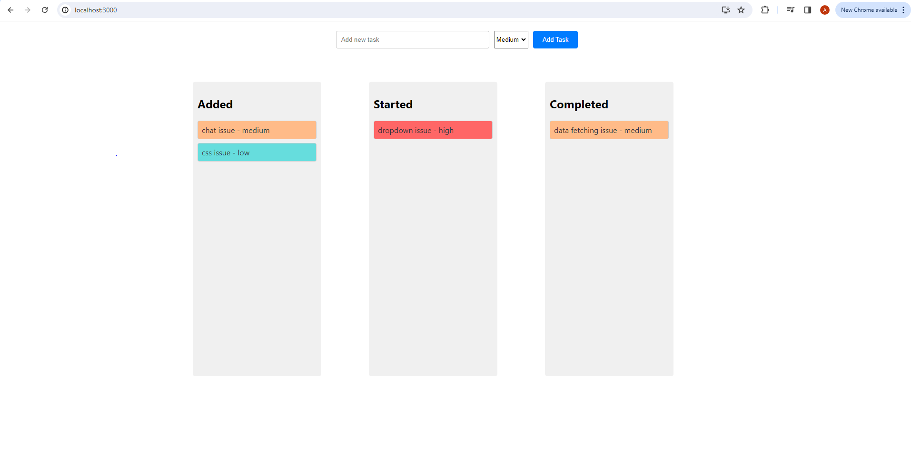

# Task Management App

This is a basic task management application built using React. It allows users to add tasks, organize them into different categories (Added, Started, Completed), and implement drag-and-drop functionality to reorder tasks within each category.



## Installation

1. Clone the repository to your local machine:

```bash
git clone https://github.com/ashish881/task-management-app.git

1. Navigate to the project directory:

cd task-management

2. Install the dependencies:

npm install

1. Start the development server:

npm start

